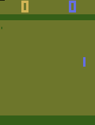
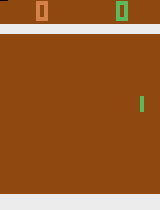
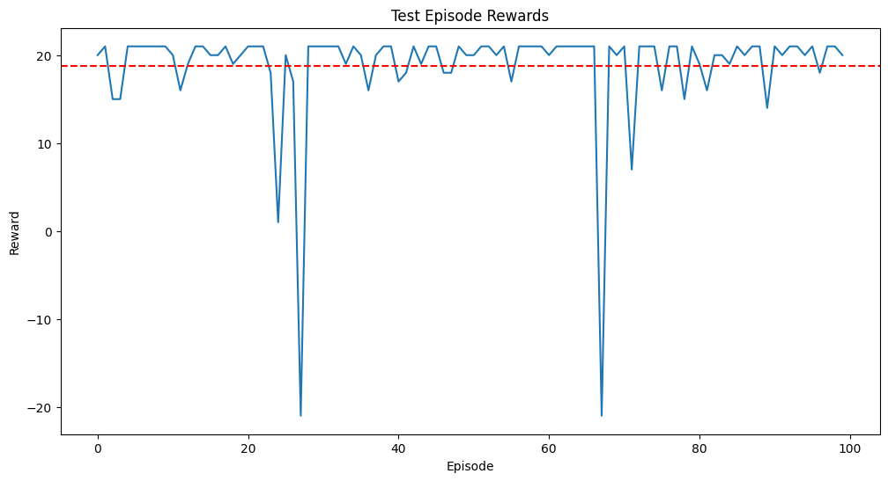
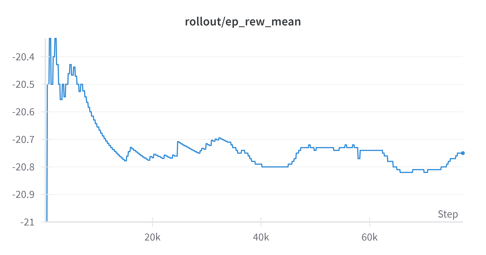

## PROJECT - PONG
This repository contains the files used to train agent to play [Pong](https://ale.farama.org/environments/pong/)

## The game:
You control the right paddle, you compete against the left paddle controlled by the computer. You each try to keep deflecting the ball away from your goal and into your opponent’s goal.
FALTA MIRAR SI ES AQUESTA VERSIO DE PONG O LA DE GYM

### Action space:
Pong's action space is Discrete(6). The different actions correspond to:
- 0: NOOP
- 1: FIRE
- 2: RIGHT
- 3: LEFT
- 4: RIGHTFIRE
- 5: LEFTFIRE

## Observation space:
Atari environments have three possible observation types: "rgb", "grayscale" and "ram".

- obs_type="rgb" -> observation_space=Box(0, 255, (210, 160, 3), np.uint8)
- obs_type="ram" -> observation_space=Box(0, 255, (128,), np.uint8)
- obs_type="grayscale" -> Box(0, 255, (210, 160), np.uint8), a grayscale version of the “rgb” type

## Untrained agent:
First and foremost, we wanted to see how an untrained agent would perform to have an ide on how the game worked.
The gifs below represents an untrained agent. 

  

## Training:
We decided to tackle this part of the project with:
- PPO

### Requirements:
Python Libraries:
- gymnasium
- stable-baselines3
- supersuit
- wandb
- numpy
- matplotlib
- Pillow

Additional Libraries:
- ale_py (for Atari environments)
- opencv-python

## Training - PPO:

During this part of the project, we trained a right paddle with a preprocessing different than the one required to compete in the tournament. 
The training and testing can be seen in [this notebook](ppo_pong_normal.ipynb).
In the notebook, we first watched the untrained agent to have a guide as to how it works and how well it performs.
We then initialize the environment with gym.make and have a preprocessing.

### Preprocessing:
- Frame skipping of 4 frames
- Grayscale conversion
- Resizing to 84 x 84
- Frame stacking (4 frames)
- Data conversion to uint8

### Training:
We use the ppo algorithm with a convolutional network policy. 
The hyperparameters are in the [constants file](ppo_pong_constants.py). The model is trained we added checkpoints to save the models as the agents is trained. 

Regarding the callbacks, the code evaluates the model performance and saves the best model. 

### Testing:
We tested the model for 100 episodes. 

These are some of the testing episodes:

    

Nevertheless this training was only on the right side. 

## Additional trials:
We then tried training the model with the preprocessing needed for the tournament. However, the training did not get satisfactory results. 
We trained one model for the [left](ppo_pong_left_train.py) side and one for the [right](ppo_pong_right_train.py) one. 

Additionally, we tried training a [single agent](ppo_pong_both.py) with both sides but for some reason the left side kept getting rewards of -21 while the right one was getting rewards of -20. Unfortunately, the ruinning of the file was very slow and the models only got saved at the end. The execution crashed and no testing could be done with it to check what happened and how was the agent behaving. 

Finally, we also tried [training with the petting zoo](pong_petting_zoo.ipynb). With the same luck, the training was to no avail. 
